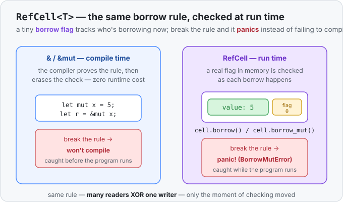

# Concept 31 · `RefCell<T>` (mutate through a shared reference) — Use it

> Pair: **Use it** (you are here) · [Under the hood](under-the-hood.md)
> Track: [From-Zero: Rust](../README.md) · Previous: [Concept 30](../30-rc/use-it.md)

## The idea
[Concept 30](../30-rc/use-it.md) ended on a wall. `Rc<T>` lets many owners share one value, but
only for **reading** — because the [borrow rules](../11-mut-references-and-borrow-rules/use-it.md)
forbid "many aliases + mutation," `Rc` never hands out a `&mut`. And those borrow rules are
enforced by the compiler: it *proves*, before your program runs, that you never have a `&mut` at
the same time as any other borrow. That proof is what keeps Rust safe with zero runtime cost.

But sometimes the compiler can't follow your logic. You *know* only one part of the code touches a
value at a time, but it's tangled across shared owners, callbacks, or a graph — and the compiler,
unable to prove it, rejects perfectly correct code. `RefCell<T>` is the escape hatch for exactly
that situation:

> **`RefCell<T>` moves the borrow check from *compile time* to *run time*. You get to mutate a
> value through a plain shared `&` — and if you break the borrow rules, it panics instead of
> refusing to compile.**

The rules themselves don't change — still **many readers XOR one writer**. What changes is *when*
they're checked: `RefCell` keeps a little counter of who's borrowing right now and checks it as the
program runs. This trick — changing a value you only hold a `&` to — is called **interior
mutability**, and `RefCell` is the everyday tool for it.



## `.borrow()` and `.borrow_mut()`
`RefCell` replaces `&` and `&mut` — which you *write* — with two *methods* you **call**:

```rust
use std::cell::RefCell;

let cell = RefCell::new(5);        // note: NOT `let mut` — see below

*cell.borrow_mut() += 10;          // borrow_mut() → a write handle; * reaches the value
println!("{}", cell.borrow());     // borrow() → a read handle; prints 15
```

- `.borrow()` gives a **shared read** handle (type `Ref<T>`) — as many at once as you like.
- `.borrow_mut()` gives an **exclusive write** handle (type `RefMut<T>`) — only one, and only when
  nobody else is borrowing.

You reach the value *through* the handle with [`*`](../10a-dereferencing-with-star/use-it.md),
exactly like any reference. Each handle automatically **gives the borrow back** when it goes out of
scope, ticking the counter down — no release call to remember.

## The surprise: no `mut` needed
Look again — `cell` was declared with plain `let`, yet we changed its contents. That's the heart of
interior mutability: the *mutation permission* lives **inside** the `RefCell`, not on the outer
binding. `.borrow_mut()` works on a shared `&RefCell<T>`, so anyone holding even a read-only
reference to the cell can still mutate what's inside. That's precisely the power `Rc` was missing —
and why the two pair up in the [next concept](../32-rc-refcell/use-it.md).

## Break the rules and it panics
Here's the trade you're accepting. With ordinary `&mut`, this is a *compile error* you fix before
shipping. With `RefCell`, it compiles fine and **panics when it runs**:

```rust
use std::cell::RefCell;

let cell = RefCell::new(5);

let a = cell.borrow_mut();
let b = cell.borrow_mut();   // 💥 panic: 'already borrowed: BorrowMutError'
```

Two live write handles at once breaks "one writer," so the second `.borrow_mut()` panics. The
compiler didn't catch it because you *asked* it to stop checking — you took the guarantee into your
own hands. The usual fix is to keep each borrow **short**: let a handle drop (end its statement or
scope) before you borrow again.

```rust
{
    *cell.borrow_mut() += 1;   // write handle created and dropped, all on one line
}                               // (the temporary handle is gone by the next statement)
let read = cell.borrow();       // fine — nothing else is borrowing now
```

## When to reach for `RefCell`
- **You need to mutate a value you only have a shared `&` to** — the compiler can't prove your
  access is exclusive, but you can reason that it is.
- **Above all, paired with [`Rc`](../30-rc/use-it.md) as `Rc<RefCell<T>>`** — many owners that all
  need to *change* the shared value, not just read it. That's the [next concept](../32-rc-refcell/use-it.md)
  and by far the most common reason you'll see `RefCell` in the wild.

If a plain `&mut` or `let mut` already compiles, **use that** — it's checked for free at compile
time and can never panic. `RefCell` is for when the compile-time check is too strict for a pattern
you can prove is safe; it buys flexibility by trading a compile-time guarantee for a runtime one.

> Quick reference: the [`RefCell<T>` handbook entry](../../../languages/rust.md#refcell) is the
> terse lookup version.

## Exercises
1. **Mutate without `mut`** — [starter](exercises/1-starter.rs) · [solution](exercises/1-solution.rs).
   Make a `RefCell<i32>` with `let` (no `mut`). Use `.borrow_mut()` to add `7` to it, then
   `.borrow()` to print the new value — proving you changed it through a non-`mut` binding.
2. **A shared tally** — [starter](exercises/2-starter.rs) · [solution](exercises/2-solution.rs).
   Write `fn bump(counter: &RefCell<i32>) { *counter.borrow_mut() += 1; }`. Make one `RefCell<i32>`
   at `0`, call `bump` on `&cell` three times, and print the final count (`3`) — a value changed
   through shared `&` references.

## Next
- What a `RefCell` *is* inside — your value plus a tiny **borrow-flag** counter, why `.borrow()` /
  `.borrow_mut()` check and update that flag, and how `Ref` / `RefMut` restore it when dropped:
  [Under the hood](under-the-hood.md).
- Then [Concept 32 — `Rc<RefCell<T>>`](../32-rc-refcell/use-it.md): stack this lesson's "mutate
  through a shared `&`" on top of Concept 30's "many owners," and you get many owners who can all
  **change** one shared value — Rust's standard shape for shared mutable state.
