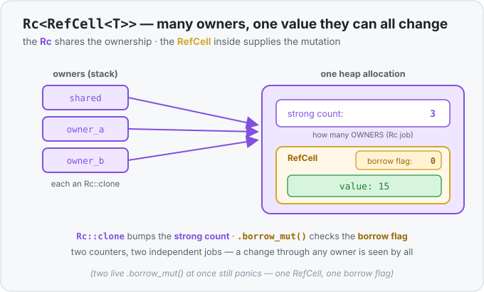

# Concept 32 · `Rc<RefCell<T>>` (shared, mutable state) — Under the hood

> Pair: [Use it](use-it.md) · **Under the hood** (you are here)
> Track: [From-Zero: Rust](../README.md)

## Two counters, two different jobs, one allocation
`Rc<RefCell<T>>` is not a new mechanism — it's the [`Rc`](../30-rc/under-the-hood.md) layout with a
[`RefCell`](../31-refcell/under-the-hood.md) sitting in the value slot. On the heap, in one
allocation, you get **three** things side by side:

1. the **strong count** — the `Rc`'s tally of *how many owners exist*;
2. the **borrow flag** — the `RefCell`'s record of *who is borrowing right now*;
3. the **value** itself.

The key insight is that those two numbers answer completely different questions and never interfere:

| | lives in | answers | changed by |
|---|---|---|---|
| strong count | the `Rc` | "how many **owners**?" | `Rc::clone` (+1), an owner dropping (−1) |
| borrow flag | the `RefCell` | "who's **borrowing** *now*?" | `.borrow()` / `.borrow_mut()` and their guards |

`Rc::clone(&x)` copies the pointer and bumps the **strong count** — it never touches the borrow
flag. `.borrow_mut()` checks and sets the **borrow flag** — it never touches the strong count. You
can have five owners (strong count 5) with nobody borrowing (flag 0), or one owner mid-write
(strong count 1, flag "written"). Ownership and borrowing are independent axes.



## A change through one owner is seen by all
Because every `Rc::clone` points at the *same* allocation, there is only ever **one** `RefCell` and
**one** value:

```rust
use std::rc::Rc;
use std::cell::RefCell;

let a = Rc::new(RefCell::new(vec![1]));
let b = Rc::clone(&a);            // strong count 2 — same RefCell, same Vec

b.borrow_mut().push(2);           // write through b's view...
println!("{:?}", a.borrow());     // [1, 2] — ...a sees it, because there's one Vec
```

`b` didn't get a copy of the vector; it got a second owner of the one on the heap. The
`.borrow_mut()` guard obtained through `b` sets the shared borrow flag, mutates the shared `Vec`,
and drops — restoring the flag — all before `a.borrow()` runs, so the read succeeds and sees the
change.

## The reference-cycle leak — why `Weak` exists
Here's the sharp edge of shared *mutable* ownership. An `Rc` frees its value only when the strong
count hits `0`. `RefCell` lets you *change* what a node points at after building it. Put those
together and you can make two nodes point at **each other**:

```text
   Rc(count 1)              Rc(count 1)
   ┌──────────┐   next →    ┌──────────┐
   │  node A  │ ─────────►  │  node B  │
   │          │  ◄───────── │          │
   └──────────┘   ← prev    └──────────┘
```

A's owner count includes the `Rc` held by B, and B's includes the `Rc` held by A. Drop your own
handles to both and their counts fall from 2 to 1 — **not** to 0, because each still holds the
other. Neither is ever freed: a **memory leak**, even in safe Rust (Rust prevents *dangling*
pointers and data races, not leaks). This can only happen once a `RefCell` lets you wire the
back-link in after creation, which is why cycles are a hazard specifically of `Rc<RefCell<T>>`
graphs.

The fix is [`Weak<T>`](../30-rc/use-it.md) — the next lesson. A `Weak` is an `Rc` handle that
*doesn't* count toward ownership: the back-link points home without propping the count up, so the
cycle can't form. The rule of thumb you'll learn: parent-owns-child uses `Rc`, child-points-back
uses `Weak`.

## Predict the behavior
```rust
use std::rc::Rc;
use std::cell::RefCell;

fn main() {
    let a = Rc::new(RefCell::new(10));
    let b = Rc::clone(&a);

    println!("{}", Rc::strong_count(&a));  // (1)

    *b.borrow_mut() += 5;                   // (2)
    println!("{}", a.borrow());             // (3)

    let one = a.borrow_mut();
    let two = a.borrow_mut();               // (4)
}
```

1. After `b = Rc::clone(&a)`, what is the strong count?
2. Does mutating through `b` affect what `a` sees?
3. What prints?
4. Two `.borrow_mut()` on the same cell, both still alive — compile error, or runtime panic?

<details>
<summary>Show the answer</summary>

1. **`2`.** `Rc::clone` made a second owner; the borrow flag is untouched by this (still `0`).
2. **Yes.** `a` and `b` own the *same* `RefCell`, so there's one shared `10`; `b`'s write changes
   it for everyone.
3. **`15`.** `a.borrow()` reads the shared, now-updated value.
4. **A runtime panic** (`already borrowed: BorrowMutError`), not a compile error. Going through two
   different `Rc` owners doesn't help — there's still one `RefCell`, and its flag forbids a second
   live write. (The compiler happily built this; the `RefCell` catches it as it runs.)
</details>

## Next
- **`Weak<T>`** finishes the smart-pointer arc: a non-owning handle that lets a structure point back
  at itself without the reference cycle above keeping it alive forever. It's the last piece of "who
  owns the heap value," and it turns `Rc<RefCell<T>>` graphs from leak-prone into safe.
