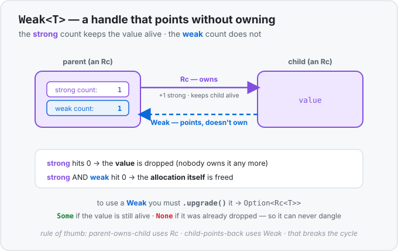

# Concept 33 · `Weak<T>` (breaking reference cycles) — Under the hood

> Pair: [Use it](use-it.md) · **Under the hood** (you are here)
> Track: [From-Zero: Rust](../README.md)

## Two counts in one allocation
Back in [Concept 30](../30-rc/under-the-hood.md) we said an `Rc` allocation holds a *count* next to
the value. The fuller truth: it holds **two** counts.

1. the **strong count** — how many **owning** handles (`Rc`) exist;
2. the **weak count** — how many **non-owning** handles (`Weak`) exist;
3. the **value** itself.

They drive two separate events, and this is the entire mechanism:

| when… | …this happens |
|---|---|
| **strong** count reaches `0` | the **value** is dropped and its destructor runs |
| **strong** *and* **weak** both reach `0` | the **allocation** (the box holding the counts) is freed |

So a `Weak` keeps the little bookkeeping box alive — just enough to record "is the value still
there?" — but it has **no say** over the value's lifetime. Only owners (strong) decide that.



- `Rc::clone(&x)` → **+1 strong** (another owner).
- `Rc::downgrade(&x)` → **+1 weak** (another pointer, *not* an owner). The strong count is untouched
  — which is the whole point.

## Why `upgrade()` can't dangle
When you call `weak.upgrade()`, Rust reads the **strong** count right then:

- strong `> 0` → the value is still alive. `upgrade` bumps the strong count by one and hands you a
  fresh `Rc<T>` — a genuine, temporary owner that keeps the value alive for as long as you hold it.
  When that `Rc` drops, strong goes back down.
- strong `== 0` → the value was already dropped. There's nothing to own, so `upgrade` returns
  `None`.

That runtime check is why a `Weak` is safe: it can point at a slot whose value may be gone, but you
can never *read* through it without first upgrading, and upgrading is exactly the moment the "is it
alive?" question gets answered. Compare a raw pointer in C, which would happily hand you the freed
memory — the `Option` here is the guard rail.

## Watch the cycle break
Here is the Concept 32 leak, now built the right way. Parent owns child with `Rc`; child points back
with `Weak`.

```text
     parent  (strong 1, weak 1)              child  (strong 1, weak 0)
     ┌───────────────────────┐   Rc (owns)   ┌───────────────────────┐
     │  value: 1             │ ────────────► │  value: 2             │
     │  children: [Rc→child] │               │  parent: Weak ┄┄┄┄┄┄┐ │
     └───────────────────────┘ ◄┄┄┄┄┄┄┄┄┄┄┄┄ └───────────────────────┘
                                Weak (points, doesn't own)
```

Follow the counts when you drop your outside handles:

| step | parent strong | child strong | freed? |
|---|---|---|---|
| both built, parent owns child | 1 | 1 | — |
| drop your `child` handle | 1 | 1 | child still owned *by parent's Vec* |
| drop your `parent` handle | **0** | 1 | parent's value drops → its `Vec` drops → the last `Rc` to child drops → child strong **0** → child drops |

The chain unwinds to zero because the only thing pointing *down* at the parent from the child was a
`Weak`, which never counted. Had that back-link been an `Rc`, dropping both outside handles would
have left parent-strong and child-strong stuck at `1` forever — the leak. **`Weak` is the one edge
in the loop that doesn't hold anything up, so the loop can always come apart.**

## Predict the memory
```rust
use std::rc::{Rc, Weak};

fn main() {
    let owner = Rc::new(String::from("hi"));
    let peek: Weak<String> = Rc::downgrade(&owner);

    println!("{} {}", Rc::strong_count(&owner), Rc::weak_count(&owner)); // (1)

    let got = peek.upgrade();               // (2)
    println!("{:?}", got.is_some());        // (3)
    drop(got);

    drop(owner);                             // (4)
    println!("{:?}", peek.upgrade());        // (5)
}
```

1. After one `Rc` and one `downgrade`, what are the strong and weak counts?
2. Does `upgrade()` here give `Some` or `None`?
3. What prints?
4. `owner` is the only *strong* handle — what happens to the `String` when it drops?
5. What does the final `upgrade()` return?

<details>
<summary>Show the answer</summary>

1. **`1 1`.** One owner (strong `1`); `downgrade` added a weak handle (weak `1`) and left strong
   alone.
2. **`Some`.** `owner` is still alive, so the strong count is `> 0`; `upgrade` succeeds and briefly
   makes strong `2` for as long as `got` lives.
3. **`true`.**
4. Dropping `owner` takes strong to `0`, so the **`String` value is dropped** (its heap buffer is
   freed). The little count box lingers because `peek` (weak `1`) still points at it.
5. **`None`.** The value is gone; `upgrade` reads strong `== 0` and safely returns `None` instead of
   a dangling pointer. When `peek` drops too, weak hits `0` and the box itself is finally freed.
</details>

## Next
- Phase 8 is complete: you can now say *exactly* who owns any heap value, share it (`Rc`), mutate it
  through a shared handle (`RefCell`), and point at it without owning it (`Weak`).
- Next, that same ownership question crosses a new boundary: a value that must be reachable from a
  **second thread**, running on its **own stack** at the **same time**. That's where concurrency
  begins — with `thread::spawn` and `move`.
