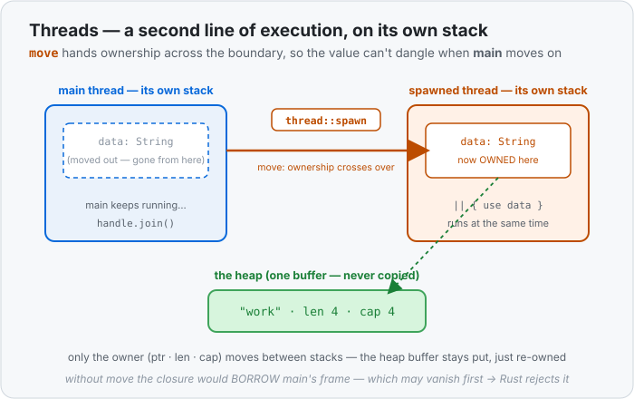

# Concept 34 · Threads (`thread::spawn` and `move`) — Use it

> Pair: **Use it** (you are here) · [Under the hood](under-the-hood.md)
> Track: [From-Zero: Rust](../README.md) · Previous: [Concept 33](../33-weak/use-it.md)

## The idea
Every program so far ran as **one line of execution**: the [call stack](../04-functions-and-the-call-stack/use-it.md)
pushed a frame, ran it, popped it, and moved to the next line — always one thing at a time, in
order. A **thread** is a *second* line of execution running **at the same time**, on its **own
separate stack**. Two threads, two stacks, both making progress at once.

You start one with `std::thread::spawn`, handing it a [closure](../26-closures/use-it.md) — the code
the new thread should run:

```rust
use std::thread;

fn main() {
    let handle = thread::spawn(|| {
        println!("hello from the spawned thread");
    });

    println!("hello from main");

    handle.join().unwrap();   // wait for the spawned thread to finish
}
```

`main` is itself a thread. `thread::spawn` starts a *second* one that runs the closure. Now two
threads are alive together, so the two `println!`s can appear **in either order** — that's the whole
point of running at the same time, and also the first thing that feels strange.

## `.join()` — wait for it to finish
`thread::spawn` returns a **`JoinHandle`**. Calling `.join()` on it means "**pause here until that
thread has finished**." Without it, `main` can reach the end and the whole program exits *while the
spawned thread is still working* — its output may simply never appear.

```rust
let handle = thread::spawn(|| 2 + 2);
let answer = handle.join().unwrap();   // waits, then hands back what the closure returned
println!("{}", answer);                 // 4
```

`.join()` returns a [`Result`](../23-result/use-it.md) — `Ok(value)` with whatever the closure
returned, or `Err` if that thread *panicked*. So a thread's panic can't silently take your program
down; you get it back as an error to handle. (`.unwrap()` here just says "I expect it to have
succeeded.")

## `move` — the thread must *own* what it uses
Here's the part that's really a memory lesson in disguise. Try to use a value from `main` inside the
thread, and the plain version won't compile:

```rust
let data = String::from("work");

let handle = thread::spawn(|| {
    println!("{}", data);   // ❌ error: closure may outlive the current function
});
```

The compiler's worry: the spawned thread might keep running **after** `main`'s function frame is
gone. If the closure only *borrowed* `data`, that borrow would point at a stack slot that no longer
exists — a dangling reference, exactly what Rust forbids. So it refuses.

The fix is the `move` keyword in front of the closure. `move` tells the closure to **take
ownership** of every variable it captures — the value is *moved into the thread*, so it lives as
long as the thread does, no matter what `main` does next:

```rust
let data = String::from("work");

let handle = thread::spawn(move || {   // `data` is MOVED into the thread
    println!("{}", data);               // ✅ the thread owns it now
});

handle.join().unwrap();
// `data` can't be used in main any more — ownership left.
```

This is the **same ownership rule from [Concept 08](../08-ownership-and-moves/use-it.md)**, now
doing a bigger job: it's what makes sharing data with a thread safe. The value belongs to exactly
one place — the thread — so it can't be read here after it's gone there.



## Order is not guaranteed
Two threads run independently, so you **cannot** assume one finishes before the other unless you
`.join()`. This prints `0 1 2 3 4` and `hello` interleaved differently on different runs:

```rust
use std::thread;

let handle = thread::spawn(move || {
    for i in 0..5 {
        println!("spawned: {}", i);
    }
});

for _ in 0..3 {
    println!("main working");
}

handle.join().unwrap();   // only here are we SURE the spawned loop is done
```

If you need a result *before* moving on, `.join()` and read its return value. If you need two
threads to touch the **same** value, a plain `move` isn't enough — ownership can only go to one
thread. That's the next problem to solve, and it's what `Arc<Mutex<T>>` is for.

## When to reach for it
- **Independent work that can happen at once** — process two files, handle two requests, do a slow
  computation off to the side while `main` stays responsive.
- **Fire-and-collect** — `spawn` several threads, then `.join()` each to gather their results.
- **Not for tiny work.** Starting a thread has a real cost (its own stack, OS scheduling); for a
  handful of quick steps, plain sequential code is faster and simpler.

> Quick reference: the [`thread::spawn` handbook entry](../../../languages/rust.md#thread-spawn)
> covers `spawn` / `join` / `move` in brief.

## Exercises
1. **Spawn, join, and read the result** — [starter](exercises/1-starter.rs) · [solution](exercises/1-solution.rs).
   `thread::spawn` a closure that computes the sum `1 + 2 + ... + 10` and *returns* it. `.join()` the
   handle, `.unwrap()` the `Result`, and print the value (`55`). Notice the returned value comes back
   *through* `join`.
2. **`move` a `String` into the thread** — [starter](exercises/2-starter.rs) · [solution](exercises/2-solution.rs).
   Make a `String` in `main`. Spawn a thread with a `move` closure that takes ownership of it and
   prints it. `.join()` to wait. Then try (in a comment) to use the `String` in `main` afterward and
   note why it no longer compiles — ownership moved into the thread.

## Next
- What two threads look like **in memory** — two independent stacks, why a borrow across them would
  dangle, and exactly what `move` transfers (the owner on the stack, never the heap buffer):
  [Under the hood](under-the-hood.md).
- Then the natural follow-up: when two threads need the **same** value, `move` alone can't split
  ownership — the thread-safe pair `Arc<Mutex<T>>` (the concurrent siblings of `Rc<RefCell<T>>`)
  takes over.
