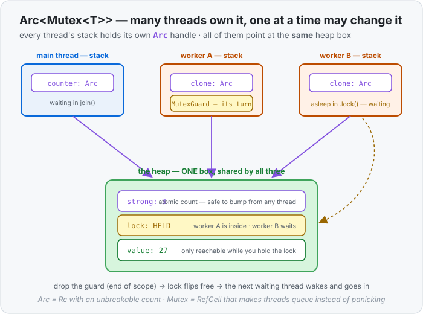

# Concept 35 · `Arc<Mutex<T>>` (shared, mutable state across threads) — Under the hood

> Pair: [Use it](use-it.md) · **Under the hood** (you are here)
> Track: [From-Zero: Rust](../README.md)

## One box on the heap, three handles on three stacks
Nothing new is invented here. `Arc<Mutex<i32>>` is one **heap** allocation holding three things
sitting next to each other:

```text
                heap — one allocation
              ┌──────────────────────────┐
   stacks     │ strong count : 3         │  ← atomic: how many Arc handles exist
   ──────     │ weak count   : 0         │
   main  ─────┤ lock flag    : free/held │  ← the Mutex: whose turn is it
   worker A ──┤ value        : 27        │  ← the data itself
   worker B ──┤                          │
              └──────────────────────────┘
```

Each thread's **own stack** holds a small `Arc` handle — one pointer's worth — and every handle
points at that same box. `Arc::clone` copies the pointer and adds 1 to the strong count; when a
thread ends, its handle drops and subtracts 1. The value is freed when the count hits **0**, exactly
like [`Rc`](../30-rc/under-the-hood.md).



So the *shape* is identical to `Rc<RefCell<T>>`. What changes is that both the count and the flag now
have to survive **two threads touching them at the same instant** — and that is exactly where the
single-threaded versions physically break.

## Why `Rc`'s count breaks across threads
"Add 1 to the count" looks like one step, but the machine does **three**:

1. **read** the count from memory (say `1`)
2. **add 1** to the value it read (`2`)
3. **write** it back

Now run two threads that both clone at the same moment, and let the steps interleave:

| step | thread A | thread B | count in memory |
|---|---|---|---|
| 1 | reads `1` | | 1 |
| 2 | | reads `1` | 1 |
| 3 | writes `2` | | 2 |
| 4 | | writes `2` | **2** |

Two clones were made, but the count says `2` instead of `3`. Later, as the handles drop, the count
reaches 0 while a handle is **still alive** — the box is freed underneath a thread still using it,
and then freed again by the last dropper: a use-after-free and a
[double free](../../../glossary/double-free.md). This is the class of bug Rust exists to prevent,
so it simply won't let an `Rc` cross a thread boundary — the compiler rejects it before the program
runs.

**`Arc` fixes it in the hardware.** Its count uses an **atomic** instruction: read-modify-write as
one indivisible step the other thread cannot slip inside. Interleaving becomes impossible, the count
is always exact — and that's the whole difference between `Rc` and `Arc`. Atomics cost a little more
than plain arithmetic, which is why `Rc` still exists for single-threaded code: you don't pay for
coordination you don't need.

## Why `RefCell`'s flag breaks — and what a lock does instead
[`RefCell`](../31-refcell/under-the-hood.md) guards its value with a small **borrow flag** it checks
at runtime: "is anyone borrowing right now?" That check is the same non-atomic read-then-write, so
two threads can both read "nobody's borrowing", and both hand out a `&mut` to the same value. Two
mutable references to one value at once is precisely what the borrow rules forbid — a **data race**,
where the final value depends on which thread's write lands last, and the answer changes run to run.

A `Mutex` replaces that flag with a real lock, and the difference in behaviour is the point:

| | `RefCell` (one thread) | `Mutex` (many threads) |
|---|---|---|
| the check | a plain flag | an atomic lock flag |
| already taken? | **panics** — a second borrow is a bug | **waits** — the thread sleeps until it's free |
| you get back | `RefMut` | `MutexGuard` inside a `Result` |
| released when | the `RefMut` drops | the guard drops |

`.lock()` is: atomically flip the flag from free to held; if it was already held, put this thread to
sleep and let the operating system wake it when the flag frees up. Only the winner walks away with a
guard, so **at most one thread at a time can reach the value** — mutual exclusion, which is where the
name comes from.

## The guard is the proof, and dropping it is the unlock
`MutexGuard` is a real value living on **your** stack, and it is the only route to the data inside
the box. That's why you can't read the value without locking: there's no other path to it. And when
the guard goes out of scope, its drop code flips the lock back to free.

This is [ownership doing cleanup](../08-ownership-and-moves/under-the-hood.md) again — the same rule
that frees a `String`'s buffer at the end of a scope also releases a lock. There is no unlock call to
forget, and an early `return` or a panic in the middle still releases it, because the guard drops
either way.

Two consequences follow directly from "the guard lives on your stack":

- **Scope = lock duration.** A guard bound with `let` lives to the end of its block, so holding one
  across slow work makes every other thread queue for that whole time. Shrink the scope, shrink the
  wait.
- **Poisoning.** If a thread panics *while holding* the guard, the value may be half-updated. The
  `Mutex` records this, and every later `.lock()` returns `Err`. That's the `Result` you've been
  `.unwrap()`-ing — Rust telling you the data may be inconsistent rather than quietly handing it over.

## Predict the memory
```rust
use std::sync::{Arc, Mutex};
use std::thread;

fn main() {
    let shared = Arc::new(Mutex::new(vec![1, 2, 3]));   // (1)

    let handle_a = Arc::clone(&shared);                   // (2)
    let worker = thread::spawn(move || {
        let mut guard = handle_a.lock().unwrap();
        guard.push(4);
    });                                                    // (3)

    worker.join().unwrap();
    println!("{:?}", *shared.lock().unwrap());
}
```

1. Where does the `Vec` live, and what is stored on `main`'s stack?
2. What does `Arc::clone` copy — the `Vec`, the `Mutex`, or something smaller?
3. When is the lock released, and what is the strong count after the thread finishes?

<details>
<summary>Show the answer</summary>

1. `main`'s stack holds only the `Arc` **handle** — one pointer. The heap allocation holds the strong
   count, the lock flag, and the `Mutex`'s `Vec` owner (`ptr/len/cap`); the vector's elements
   `[1, 2, 3]` sit in a second heap buffer that owner points to.
2. Just the **pointer**, plus an atomic `+1` on the strong count (now `2`). No `Vec`, no `Mutex`, and
   no elements are copied — that's why sharing is cheap.
3. The lock is released when `guard` **drops** at the end of the closure — automatically, no unlock
   call. When the thread finishes, `handle_a` drops too, so the count goes back to `1`; `main`'s
   handle is the last owner, and the box is freed when `main` ends.
</details>

## Next
- You can now share one value across threads and take turns changing it. Notice what it cost: every
  thread must agree on a lock, and while one is inside, the others sit still.
- The next concept is the other half of Rust concurrency, and it avoids the lock entirely: a
  **channel**, where threads **send owned values** to each other instead of sharing memory. Ownership
  moves down a pipe — so there is nothing shared left to guard.
