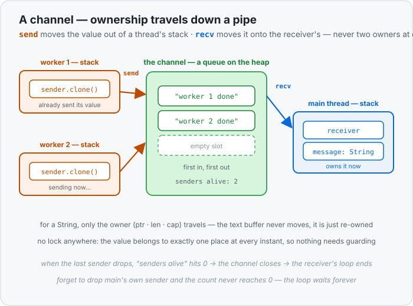

# Concept 36 · Channels (`mpsc::channel`) — Use it

> Pair: **Use it** (you are here) · [Under the hood](under-the-hood.md)
> Track: [From-Zero: Rust](../README.md) · Previous: [Concept 35](../35-arc-mutex/use-it.md)

## The idea
[Concept 35](../35-arc-mutex/use-it.md) solved "many threads, one value" by **sharing memory**: put
the value in one box, and make threads queue for a lock before touching it. It works, but look at
what it costs — every thread has to know about the lock, and while one is inside, the rest sit still.

There is a second answer, and it's often the nicer one: don't share anything. **Send the value.**

A **channel** is a one-way pipe between threads. One end **sends** values in; the other end
**receives** them out, in order. Nothing is shared, so there is no lock to take, no turn to wait for —
because sending **moves ownership** down the pipe. The sender gives the value up; the receiver
becomes its new owner. It's the plain [ownership rule](../08-ownership-and-moves/use-it.md) from
Concept 08, used as the whole safety mechanism.

The Go language has a slogan for this that Rust borrows the spirit of: *"Do not communicate by
sharing memory; instead, share memory by communicating."*



## Making one: `mpsc::channel()`
```rust
use std::sync::mpsc;
use std::thread;

fn main() {
    let (sender, receiver) = mpsc::channel();

    thread::spawn(move || {
        sender.send(String::from("hello from the worker")).unwrap();
    });

    let message = receiver.recv().unwrap();
    println!("{}", message);
}
```

Three things to read off that:

1. **`mpsc::channel()` hands back a pair** — the sending end and the receiving end, and you take them
   apart with a tuple `let`. `mpsc` stands for **m**ultiple **p**roducer, **s**ingle **c**onsumer:
   many threads may send, exactly one may receive.
2. **`move` sends the *sender* into the thread.** The sending end is itself a value you own, so it
   travels into the worker like any other captured value.
3. **`.send(v)` moves `v` into the channel.** After that line, the worker can't use the `String` any
   more — it belongs to the channel, and then to whoever receives it.

Both `.send()` and `.recv()` return a [`Result`](../23-result/use-it.md), and each `Err` means one
specific thing:

- **`send` fails** when the receiving end has been dropped — nobody is left to hear you.
- **`recv` fails** when *every* sending end has been dropped — nobody is left to speak.

## `for received in receiver` — read until the pipe closes
`.recv()` fetches one value and **blocks**: if the pipe is empty, the thread sleeps until something
arrives. Usually you want *all* the values, so treat the receiver as an
[iterator](../27-iterator-adapters/use-it.md):

```rust
use std::sync::mpsc;
use std::thread;

fn main() {
    let (sender, receiver) = mpsc::channel();

    thread::spawn(move || {
        for n in 1..=5 {
            sender.send(n).unwrap();
        }
    });

    let mut total = 0;
    for received in receiver {      // one value per turn, blocking between them
        total += received;
    }

    println!("{}", total);           // 15
}
```

The loop yields values as they arrive and **ends by itself** when the last sender is gone — here,
when the worker thread finishes and its `sender` drops. Notice there's no `.join()`: the loop ending
*is* the proof that the worker is done sending.

## Many producers: clone the sender
`mpsc` means many threads can send into the same pipe. To give each one its own sending end, **clone
the sender** — the same "one handle per thread" move you did with `Arc::clone`:

```rust
use std::sync::mpsc;
use std::thread;

fn main() {
    let (sender, receiver) = mpsc::channel();

    for worker_id in 1..=3 {
        let worker_sender = sender.clone();       // one sending end per thread
        thread::spawn(move || {
            worker_sender.send(format!("worker {} done", worker_id)).unwrap();
        });
    }

    drop(sender);                                  // ⚠️ the original must go too

    for message in receiver {
        println!("{}", message);
    }
}
```

**That `drop(sender)` is the trap everybody hits once.** The loop only ends when *every* sender is
gone — and `main` is still holding the original one. Without the `drop`, the program prints all three
messages and then **hangs forever**, waiting for a fourth that can never come. Dropping it (or
letting it fall out of scope before the loop) closes the pipe properly.

If you'd rather not block at all, `.try_recv()` returns immediately — `Ok(value)` if something was
waiting, `Err` if the pipe is momentarily empty — so a thread can check for messages and get on with
other work in between.

## Channel or `Arc<Mutex<T>>`?
Both let threads work together; they answer different questions.

| | **Channel** | **`Arc<Mutex<T>>`** |
|---|---|---|
| the model | **hand values over** | **share one value** |
| ownership | moves, one owner at a time | many owners at once |
| coordination | none needed — nothing is shared | every access takes the lock |
| fits | pipelines, work queues, collecting results | a counter, a cache, one state everyone edits |
| typical bug | forgetting to drop a sender → hangs | holding the lock too long → threads queue |

Rule of thumb: **if the value can travel, send it.** Reach for the lock only when threads genuinely
need to read *and* write one shared thing.

> Quick reference: [`mpsc::channel`](../../../languages/rust.md#mpsc-channel) in the handbook.

## Exercises
1. **Send five numbers and add them up** — [starter](exercises/1-starter.rs) · [solution](exercises/1-solution.rs).
   Spawn one thread that sends `1..=5` into a channel. In `main`, loop over the receiver, sum what
   arrives, and print `15`. No `.join()` needed — work out why the loop stops on its own.
2. **Three producers into one receiver** — [starter](exercises/2-starter.rs) · [solution](exercises/2-solution.rs).
   Clone the sender for three worker threads, each sending one report line. Collect everything into a
   `Vec`, sort it, print it. Then comment out the `drop(sender)` and watch the program hang — that's
   the "a sender is still alive" rule making itself felt.

## Next
- What a channel **is** in memory — a queue on the heap, handles on each stack, and how a value's
  ownership travels from one stack, through the queue, onto another: [Under the hood](under-the-hood.md).
- After that, Phase 9's last question: what if a thread shouldn't *block* while it waits? That's where
  `async` comes in.
