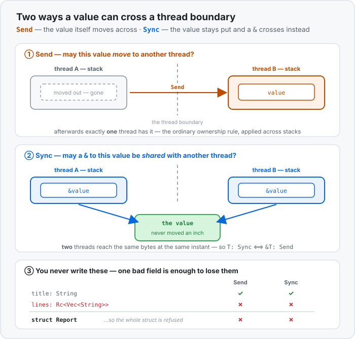

# Concept 37 · `Send` and `Sync` (what may cross a thread) — Under the hood

> Pair: [Use it](use-it.md) · **Under the hood** (you are here)
> Track: [From-Zero: Rust](../README.md)

## These traits are not in the value
Start with the thing that surprises people: **`Send` and `Sync` add nothing to a value in memory.**
No flag, no tag, no vtable pointer, not one bit. `Rc<i32>` and `Arc<i32>` are both **8 bytes** — one
pointer each — and they look identical at runtime:

```text
   Rc<Vec<String>>            Arc<Vec<String>>
   ┌──────────────┐           ┌──────────────┐
   │ ptr ─────────┼──►heap    │ ptr ─────────┼──►heap
   └──────────────┘           └──────────────┘
        8 bytes                    8 bytes
```

The difference is entirely in what the **compiler knows** about them, and it's spent before the
program starts. `Send` and `Sync` are **marker traits**: traits with no methods, whose only job is to
be present or absent so a bound can ask about them. Swapping `Rc` for `Arc` changes which bounds you
satisfy — and the count instruction the heap box uses — not the shape of anything on your stack.

That's why the check costs nothing at runtime. There is no "is this sendable?" test happening as your
program runs. There is a compile that either finished or didn't.

## The boundary is a function signature
"Crossing a thread boundary" sounds like a special mechanism. It isn't. It's `thread::spawn`'s
ordinary signature, with ordinary [trait bounds](../20-traits/use-it.md) on it:

```rust
pub fn spawn<F, T>(f: F) -> JoinHandle<T>
where
    F: FnOnce() -> T + Send + 'static,
    T: Send + 'static,
```

Read it as English and every threading rule you've met so far falls out of it:

- **`F: Send`** — the closure itself must be sendable. A [closure](../26-closures/use-it.md) is a
  struct the compiler builds out of what it captures, so *it* is `Send` exactly when all its captures
  are. Capture an `Rc` and the closure is not `Send`; that's why the error points at the closure and
  then at the field inside it.
- **`F: 'static`** — no captured borrow may outlive the thread. This is the bound that forces `move`,
  and you met it in [Concept 34](../34-threads/use-it.md) before you had a name for it.
- **`T: Send`** — whatever the closure *returns* comes back to the joining thread, so it crosses the
  boundary too.

The channel does the same thing one layer down: `Sender<T>` is only `Send` when `T: Send`, so
[`send`](../36-channels/use-it.md) can't smuggle across anything `spawn` would have refused.

## Auto traits: derived from the parts, all the way down
Ordinary traits are opt-in — you write `impl Display for Report` or nothing happens. `Send` and `Sync`
are **auto traits**, and they work the other way round: the compiler grants them to your type
automatically as long as every part qualifies.

```text
   struct Report {
       title: String,            Send ✅  Sync ✅
       count: u32,               Send ✅  Sync ✅
       lines: Rc<Vec<String>>,   Send ❌  Sync ❌   ← one bad field
   }
   ───────────────────────────────────────────────
   Report                        Send ❌  Sync ❌
```



It's structural and recursive: a `Vec<Report>` isn't `Send` either, nor a `Box<Report>`, nor a closure
that captured one. This is why the compiler can name the culprit precisely — it walks the type down
to the leaf that failed and prints the chain it walked:

```
= help: the trait `Send` is not implemented for `Rc<Vec<String>>`
note: required because it appears within the type `Report`
note: required because it's used within this closure
note: required by a bound in `spawn`
```

Four lines, read bottom to top: `spawn` wants `Send` → the closure isn't → because `Report` isn't →
because that one field isn't. Compiler errors of this shape are a *map*, not a complaint.

The opt-out exists too, spelled `impl !Send for MyType {}`, and the standard library uses it for `Rc`,
`RefCell`, `MutexGuard` and raw pointers. Going the other way — claiming a trait the compiler
wouldn't grant — is `unsafe impl Send for MyType {}`, and it means *"I have checked by hand that this
is safe to move between threads; hold me to it."* That's the only door out, and it's the door
`Arc` and `Mutex` themselves walk through, since their safety comes from atomics and locks the
compiler can't reason about on its own.

## The `Sync` definition, in memory terms
> `T: Sync` ⟺ `&T: Send`

Put it on the stack and it stops being abstract. Sending a `&T` to another thread doesn't move
anything — the value stays where it was, and now **two stacks hold a pointer to the same bytes**:

```text
   thread A stack            heap                thread B stack
   ┌──────────────┐    ┌──────────────────┐    ┌──────────────┐
   │ &value ──────┼───►│  the value       │◄───┼─ &value      │
   └──────────────┘    └──────────────────┘    └──────────────┘
                       both threads may read this at the same instant
```

So `Sync` is the question "is it safe for two threads to touch this at once?", and `Send` is "is it
safe for one thread to have it instead of another?". A `RefCell` answers **yes** to the second and
**no** to the first, because its borrow flag assumes it is the only one being consulted — the
mechanism is in [Concept 35](../35-arc-mutex/under-the-hood.md#why-refcells-flag-breaks--and-what-a-lock-does-instead).

Everything with no interior mutability and no shared state — `i32`, `String`, `Vec<i32>`, your plain
structs — is both, because there is nothing to race on. Immutable sharing was never the danger.

## Why `MutexGuard` is the odd one out
`MutexGuard` is `Sync` but **not** `Send`, which is the reverse of `RefCell` and looks arbitrary until
you know what a guard is: it isn't the data, it's a *receipt for a lock you are holding*.

Underneath, a `Mutex` is usually the operating system's own lock, and on several platforms those are
**owner-bound**: the thread that locked must be the thread that unlocks. The guard's `drop` is what
unlocks. So if a guard could be `Send`, you could lock on thread A, ship the guard to thread B, and
have B's drop unlock a mutex A owns — undefined behaviour at the OS level, well below anything Rust
could catch afterwards.

Making the guard `!Send` turns that into a compile error instead. It's also the real reason behind a
rule you'll meet everywhere later: **don't hold a `MutexGuard` across a thread hand-off** (and in
Phase 10, across an `.await`). It isn't style advice. The type system forbids it.

`Sync` it still is: `&MutexGuard<T>` only lets you *read* through to the data, so sharing that
reference is exactly as safe as sharing a `&T`.

## Predict the memory
```rust
use std::cell::RefCell;
use std::rc::Rc;
use std::sync::{Arc, Mutex};
use std::thread;

struct Job {
    name: String,
    log: RefCell<Vec<String>>,       // (1)
}

fn main() {
    let job = Job { name: String::from("build"), log: RefCell::new(Vec::new()) };
    thread::spawn(move || { job.log.borrow_mut().push(job.name.clone()); });   // (2)

    let shared = Arc::new(RefCell::new(0));                                     // (3)
    let counted = Rc::new(5);
    let atomic = Arc::new(5);                                                   // (4)

    let _ = (shared, counted, atomic, Mutex::new(0));
}
```

1. Is `Job` `Send`? Is it `Sync`?
2. Does that `spawn` compile?
3. `Arc` is the thread-safe pointer. Can `Arc<RefCell<i32>>` be sent to a thread?
4. How many bytes do `counted` and `atomic` each occupy on `main`'s stack?

<details>
<summary>Show the answer</summary>
<ol>
<li><strong><code>Send</code> yes, <code>Sync</code> no.</strong> Every field is <code>Send</code> (<code>String</code> is, and <code>RefCell&lt;Vec&lt;String&gt;&gt;</code> is because its contents are), so the struct is. But <code>RefCell</code> is not <code>Sync</code>, and one non-<code>Sync</code> field is enough — so <code>Job</code> isn't either.</li>
<li><strong>Yes, it compiles.</strong> <code>spawn</code> only demands <code>Send</code>, and the closure <em>moves</em> the whole <code>Job</code> in. After the move, <code>main</code> can't touch <code>job</code> at all, so only one thread ever consults that borrow flag — precisely the situation <code>RefCell</code> was built for. Being <code>!Sync</code> never comes up.</li>
<li><strong>No.</strong> An <code>Arc</code> gives <em>every</em> holder a shared reference to one value, so <code>Arc&lt;T&gt;</code> is only <code>Send</code> when <code>T</code> is both <code>Send</code> <strong>and</strong> <code>Sync</code>. <code>RefCell</code> fails the second half, and the compiler says so in one line: <code>required for Arc&lt;RefCell&lt;i32&gt;&gt; to implement Send</code>. The fix is <a href="../35-arc-mutex/use-it.md"><code>Arc&lt;Mutex&lt;T&gt;&gt;</code></a> — swap the flag for a lock and <code>Sync</code> comes back.</li>
<li><strong>8 bytes each</strong> — one pointer, identical layout. <code>Rc</code> and <code>Arc</code> differ in the <em>instruction</em> used on the count in the heap box and in the traits the compiler grants them, never in their size or shape. The whole of this concept is bookkeeping that evaporates at compile time.</li>
</ol>
</details>

## Next
- Phase 9 is complete, and it turned out to be smaller than it looked: `move`, `Arc`, `Mutex`, the
  channel — every rule was one of two traits being checked at a function boundary.
- Both halves still **block**, though: a thread waiting on `.lock()` or `.recv()` is parked, holding a
  whole OS stack while doing nothing. Phase 10 opens with `async`, where a waiting task doesn't own a
  stack at all — and where `Send` shows up again, this time as a bound on futures.
