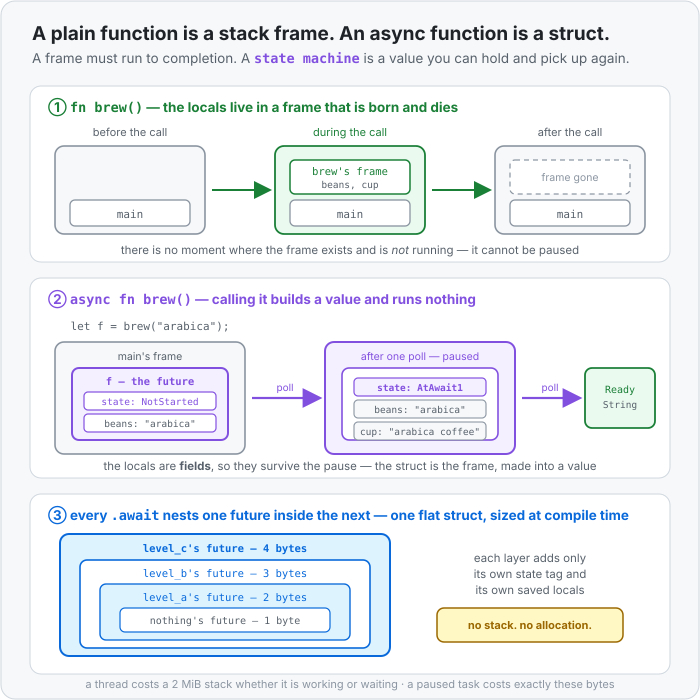

# Concept 38 · `async` and `.await` (a function that can pause) — Under the hood

> Pair: [Use it](use-it.md) · **Under the hood** (you are here)
> Track: [From-Zero: Rust](../README.md)

## `async fn` is a return type in disguise
The keyword rewrites the signature. These two are the same function:

```rust
async fn add_one(x: u32) -> u32 {
    x + 1
}

fn add_one(x: u32) -> impl Future<Output = u32> {
    async move { x + 1 }
}
```

`async` on a function means: *keep the body, but change what I return from `u32` to
**something that will eventually produce a `u32`***. That "something" is a type the compiler invents
for this one function — it has no name you can write, which is why the signature says
[`impl Future`](../../../languages/rust.md#impl-trait-arg) rather than naming it.

So the body isn't code that runs at the call. It's a **description** of work, compiled into a type.
Calling the function constructs one instance of that type. That's the entire reason nothing happens.

`async` also works on a bare block — `async { ... }` — which builds the same kind of value without a
function wrapper. Same rule: making one runs nothing.

## What the compiler builds: an enum with your locals in it
The invented type is a **state machine**. Take a function that pauses twice:

```rust
async fn breakfast() -> String {
    let cup = brew("arabica").await;
    let toast = toast_bread().await;
    format!("{cup} and {toast}")
}
```

There are three places this function can be: not started, paused at the first `.await`, paused at the
second. So the compiler builds roughly this — an [enum](../14-enums/use-it.md) with one variant per
resting place, each variant holding exactly the locals that must survive that pause:

```rust
enum BreakfastFuture {
    NotStarted,
    AtBrew   { brew_future: BrewFuture },
    AtToast  { cup: String, toast_future: ToastFuture },
    Finished,
}
```

Read the variants and the whole memory picture falls out:

- **`NotStarted`** holds the arguments and nothing else — the state you get back from the call.
- **`AtBrew`** holds the inner future, because resuming `breakfast` means resuming `brew` first.
- **`AtToast`** holds `cup`. It has to: `cup` was created before this pause and is used after it.
  `brew_future` is *gone* from this variant — it finished, so it is no longer carried.
- **`Finished`** holds nothing.

This is the answer to "where do the locals live". In a normal function they live in a
[stack frame](../04-functions-and-the-call-stack/use-it.md), which is why they can't survive a pause
— the frame goes away. Here they are **fields of a value you own**, so they survive by definition.



## Why the size is what it is
An enum is as big as its largest variant. That single sentence explains every number you measured:

| what you wrote | what the enum must hold | size |
|---|---|---|
| `async fn nothing() {}` | no locals, no awaits — one state tag | 1 byte |
| `level_a` awaiting `nothing` | tag + `nothing`'s 1-byte future | 2 bytes |
| `level_b` awaiting `level_a` | tag + `level_a`'s 2-byte future | 3 bytes |
| `scoped_then_await` (array dies before the pause) | tag + a `u64` | 16 bytes |
| `held_across_await` (array crosses the pause) | tag + the whole `[u8; 512]` | 514 bytes |

The last row is the one to keep. Nothing about the *work* differs between those two functions — the
array is built and measured either way. What differs is whether the array is still alive at the
suspend point, because that is precisely what decides if it becomes a field.

Two consequences you will meet later, both now predictable rather than mysterious:

- A deep chain of `.await`s builds one flat struct, not a stack of frames. Recursion is the exception
  — an `async fn` that awaits itself would need a type containing itself, infinitely large, so it
  needs a [`Box`](../29-box/use-it.md) to break the cycle. Same reason as a recursive enum.
- A big future is copied around by value. That's why runtimes usually `Box` a task once and then move
  the pointer instead.

## Nothing is allocated, and nothing is scheduled
It's worth being blunt about what `async` does *not* do:

```text
   main's stack frame
   ┌────────────────────────────┐
   │  future: BreakfastFuture   │  ← the whole paused call chain, right here
   │  ┌──────────────────────┐  │
   │  │ state: AtBrew        │  │
   │  │ brew_future: {...}   │  │
   │  └──────────────────────┘  │
   └────────────────────────────┘
   no heap allocation · no thread · no OS involvement · no scheduler
```

Creating a future is a struct initialisation. It is roughly as expensive as writing
`let point = Point { x: 1, y: 2 };`. There is no runtime cost waiting behind the keyword — this is
the "zero-cost abstraction" promise, and here you can see the actual mechanism rather than take it on
faith. All the cost lives in the executor you choose to drive it with.

Which also means an `async fn` that never gets driven simply never happens. No leak, no dangling
thread, no half-finished work: the value is dropped, its saved locals are dropped with it, and that's
that. **Rust futures are lazy**, and cancelling one is just dropping it.

## Why a paused future may not move
One loose end from `block_on`, worth naming now because it explains an error you will hit.

Locals can borrow each other:

```rust
async fn holds_ref() -> usize {
    let text = String::from("hello");
    let slice = &text[..];     // slice points INTO text
    nothing().await;           // both must survive the pause
    slice.len()
}
```

Both `text` and `slice` become fields of the same future — and `slice` holds a pointer to `text`,
which is a field **of the same struct**. The struct now points at itself. Move it one byte in memory
and that pointer aims at where `text` used to be. A [dangling reference](../25-lifetimes/use-it.md),
of exactly the kind Rust exists to prevent.

The compiler's answer is a promise, not a check: once a future has been polled, it must never move
again. That promise is spelled `Pin`, and it's why `block_on` starts with `pin!(future)`. Try to skip
it and the compiler names the rule directly:

```
error[E0277]: `{async fn body of holds_ref()}` cannot be unpinned
   = note: within `impl Future<Output = usize>`, the trait `Unpin` is not implemented
```

`Unpin` means "safe to move even after polling" — true for ordinary types, false for the
self-referential state machines `async` generates. You do not need to understand `Pin`'s API to write
async code; you need to know that `pin!` is where you pin a future to one address before driving it.
The mechanics are in [Concept 39](../39-future-poll-and-the-executor/under-the-hood.md).

## Predict the memory
```rust
async fn nothing() {}

async fn one() -> u32 {
    let counter: u32 = 0;
    nothing().await;
    counter + 1
}

async fn two() -> usize {
    let words = vec![String::from("a"), String::from("b")];   // (2)
    let count = words.len();
    nothing().await;
    count
}

fn main() {
    let first = one();                    // (1)
    let second = nothing();               // (3)
    let _ = (first, second, two());       // (4)
}
```

1. After line `(1)`, how many times has `one`'s body run?
2. Is that `Vec`'s heap buffer part of `two`'s future?
3. `nothing()` has no locals and no awaits. Why isn't its future zero bytes?
4. `main` ends without ever driving any of them. Does the `Vec` leak?

<details>
<summary>Show the answer</summary>

1. **Zero times.** `one()` allocated no stack frame and executed no statement. It built a
   `NotStarted` value on `main`'s stack and returned it. `counter` does not exist yet — it comes into
   being the first time something polls the future.
2. **No — but the pointer to it is.** The `Vec` is still three words on the stack
   ([Concept 17](../17-vec/use-it.md)): pointer, length, capacity. Those 24 bytes become a field of
   the future because `words` is alive across the `.await`. The buffer they point at stays on the
   heap, untouched and unmoved. This is the general shape: a future stores the *stack part* of every
   local it must carry, and heap data is reached through the pointers it carries.
3. **Because a zero-sized value has no address of its own,** and Rust guarantees every distinct value
   you can take a reference to has a distinct address. One byte is the minimum for a type you hold,
   move, and poll through a `&mut`. The state tag needs it anyway — even "not started vs finished" is
   two states.
4. **No.** Dropping `two`'s future drops its fields, and one of those fields is `words` — so `Vec`'s
   `Drop` frees the heap buffer exactly as it would at the end of any scope. Nothing about being
   paused suspends ownership. This is what makes async cancellation in Rust cheap and safe: **you
   cancel a task by dropping it**, and ordinary [ownership](../08-ownership-and-moves/use-it.md)
   cleans up everything it was holding.
</details>

## Next
- You now know what a future *is*: a struct with your locals in it and a tag saying where it stopped.
  What you don't know is what `poll` returns when it can't finish, or how the executor knows to try
  again — the two things that turn pausing into **many tasks on one thread**.
- [Concept 39](../39-future-poll-and-the-executor/use-it.md) opens the black box: the `Future` trait,
  `Poll::Pending`, the `Waker`, and a hand-written executor that interleaves two tasks without
  spawning a single thread.
