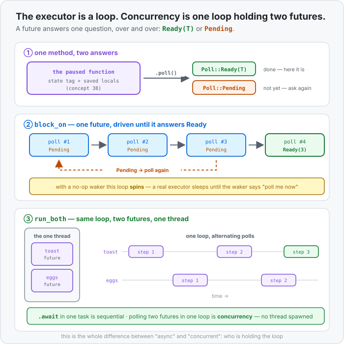

# Concept 39 · `Future`, `poll`, and the executor (who runs a paused function) — Under the hood

> Pair: [Use it](use-it.md) · **Under the hood** (you are here)
> Track: [From-Zero: Rust](../README.md)

## Polling doesn't restart anything
The first worry people have about a poll loop is that asking again re-runs the function from the top.
It doesn't, and [Concept 38](../38-async-and-await/under-the-hood.md) already explained why: the
future is an enum, and its tag says where to resume.

A `poll` call is, in effect, one `match` on that tag and a jump:

```text
   poll(&mut future)
        │
        ├─ state = NotStarted  → run from the top, until the first .await
        ├─ state = AtBrew      → jump straight into brew's saved future
        └─ state = AtToast     → jump past both awaits, finish the body
```

No work is repeated, because every local that survived is already in a field. Resuming a paused task
is a tag check and a jump — a handful of instructions, no stack to rebuild, no OS call. That cheapness
is why an executor can afford to poll thousands of tasks in a loop.

The one rule you must not break: **never poll a future after it returned `Ready`.** The tag is now
`Finished`, and there's nothing to jump to. For a compiler-generated future you get a clean panic:

```
thread 'main' panicked at src/main.rs:5:25:
`async fn` resumed after completion
```

Which is why `run_both` keeps an [`Option`](../15-option/use-it.md) per task. That `is_none()` guard
isn't tidiness — it's the loop remembering which futures are still legal to touch.



## Why `poll` takes `Pin` and not `&mut self`
This is the piece of async that looks like bureaucracy and isn't. Put the state machine on the stack
and look at what a self-borrow does to it:

```rust
async fn holds_ref() -> usize {
    let text = String::from("hello");
    let slice = &text[..];     // points INTO text
    nothing().await;
    slice.len()
}
```

Both locals cross the pause, so both are fields of one struct — and one field points at another:

```text
   the future, parked at address 0x1000
   ┌──────────────────────────────────────┐
   │ state: AtAwait                       │
   │ text:  String { ptr, len, cap }      │ ← lives at 0x1008
   │ slice: &str  { ptr ──────────────────┼──► 0x1008
   └──────────────────────────────────────┘

   move the whole struct to 0x2000 and `slice.ptr` still says 0x1008 — garbage
```

Ordinary Rust values survive being moved because a move is a byte copy and nothing outside points
into them. A self-referential struct breaks that assumption, and it's the one place the language
generates such a struct for you.

The fix isn't a runtime check. It's a **promise encoded in a type**: `Pin<&mut T>` is a `&mut T` you
are not allowed to move out of. Since `poll` is the only way to start a future running, requiring
`Pin` there means *you cannot poll a future you haven't first promised to keep still.*

`Unpin` is the opt-out for types that don't care — `i32`, `String`, your structs, anything with no
interior self-reference. Almost everything is `Unpin`; `async`-generated futures are the famous
exception, and the compiler says so plainly:

```
error[E0277]: `{async fn body of holds_ref()}` cannot be unpinned
   = note: within `impl Future<Output = usize>`, the trait `Unpin` is not implemented
```

Two ways to make the promise, and the choice is exactly the stack/heap choice you've been making
since [Concept 07](../07-the-heap-and-string/use-it.md):

- **`pin!(future)`** — pins it in the current stack frame. Free, but the future can't outlive that
  frame. This is what `block_on` uses.
- **`Box::pin(future)`** — moves it to the heap *once*, then pins it there. Costs an allocation, and
  in return the task can be stored in a `Vec`, put in a queue, handed to a scheduler. Every real
  runtime does this, which is why a spawned task type is usually `Pin<Box<dyn Future + Send>>` — a
  [trait object](../21-trait-objects/use-it.md), boxed, pinned. Every word in that type is now one
  you have met.

## The `Waker` — why a busy loop is the wrong executor
Your `block_on` is correct and wasteful. On `Pending` it immediately asks again, so a task waiting
two seconds for a network reply gets polled millions of times, at 100% of a CPU core, to be told
"still no" every time. That's worse than the blocked thread you were trying to avoid.

The missing half is in the `Context` you've been passing without using:

```rust
fn poll(self: Pin<&mut Self>, cx: &mut Context<'_>) -> Poll<Self::Output>
                              ^^^^^^^^^^^^^^^^^^^^
```

`cx` carries a **`Waker`** — a handle with one meaningful method, `wake()`, meaning *"this task can
make progress now; put it back in the run queue."* And that turns polling into a contract:

> A future may return `Pending` **only after** it has arranged for `wake()` to be called when the
> thing it's waiting on is ready. Return `Pending` without doing that, and the task hangs forever.

With the contract kept, a real executor never spins:

```text
   1. poll(task)  →  Pending      the task cloned the waker and handed it to the OS
   2. run queue empty → the thread SLEEPS (epoll / kqueue / IOCP — zero CPU)
   3. the socket becomes readable → the OS wakes the thread
   4. waker.wake() → task pushed back onto the run queue
   5. poll(task)  →  Ready(response)
```

`Waker::noop()` is the honest admission that your four-line executor has no step 2 to sleep into and
no OS registration to do. It's a real waker whose `wake()` does nothing, so the loop's only option is
to ask again — and that's fine for the `Pause` future, which becomes ready purely by being asked.
A future that waits on the *outside world* needs a real one.

Under the hood a `Waker` is a fat pointer — data plus a hand-written vtable of function pointers —
because the executor's task type isn't known to `std`. Building one by hand needs
[`unsafe`](../README.md), which is the next concept, and is exactly why `Waker::noop()` exists as the
safe stand-in.

## `Send` comes back, and so does the guard
[Concept 37](../37-send-and-sync/use-it.md) said `Send` decides what may cross a thread. A future is
an ordinary struct, so it gets the ordinary auto-trait rule — **a future is `Send` if every local it
carries across an `.await` is `Send`** — and multi-threaded runtimes demand it, because a work-stealing
pool may resume a paused task on a different thread than the one that last polled it:

```rust
pub fn spawn<F>(future: F) -> JoinHandle<F::Output>
where
    F: Future + Send + 'static,
```

Now the rule from Concept 37 that looked like style advice — *don't hold a `MutexGuard` across an
`.await`* — turns out to be enforced by the type system, and you can prove it with the same two-line
probe you wrote then:

```rust
fn assert_send<F: Future + Send>(_future: F) {}

async fn guard_dropped_first(lock: &Mutex<u32>) -> u32 {
    let value = { *lock.lock().unwrap() };   // guard dies at the closing brace
    nothing().await;
    value
}

async fn guard_held_across(lock: &Mutex<u32>) -> u32 {
    let guard = lock.lock().unwrap();
    nothing().await;                          // guard must survive this
    *guard
}
```

The first passes. The second doesn't, and the error is a complete explanation of the last two
concepts in one message:

```
error: future cannot be sent between threads safely
   = help: within `impl Future<Output = u32>`, the trait `Send` is not implemented
           for `std::sync::MutexGuard<'_, u32>`
note: future is not `Send` as this value is used across an await
   |     let guard = lock.lock().unwrap();
   |         ----- has type `MutexGuard<'_, u32>` which is not `Send`
   |     nothing().await;
   |               ^^^^^ await occurs here, with `guard` maybe used later
```

Read the chain: the guard is held across the await → so it becomes a **field** of the future
(Concept 38) → the future inherits `!Send` from that field (Concept 37) → so it can't be spawned. One
error, three concepts, no new rules. Holding a lock across an await is also a *deadlock* waiting to
happen — the task might be parked for a second while every other task queues on that mutex — so the
compiler stopping you is doing you two favours at once.

## Predict the memory
```rust
struct Pause { polls_left: u32 }

impl Future for Pause {
    type Output = ();
    fn poll(mut self: Pin<&mut Self>, _cx: &mut Context<'_>) -> Poll<()> {
        if self.polls_left == 0 {
            Poll::Ready(())
        } else {
            self.polls_left -= 1;
            Poll::Pending
        }
    }
}

async fn work() -> u32 {
    pause(3).await;          // (1)(2)
    42
}

fn main() {
    let future = work();     // (3)
    let answer = block_on(future);
    println!("{answer}");
}
```

1. How many times does `block_on` call `poll` on `work`'s future before it gets `Ready`?
2. Where does the `polls_left` counter live between polls — and who owns it?
3. `block_on` takes `future` **by value**, then pins it. Which stack frame is the future parked in
   while it runs, and can a poll move it?
4. If `Pause::poll` returned `Pending` forever, what would this program do?

<details>
<summary>Show the answer</summary>
<ol>
<li><strong>Four.</strong> <code>pause(3)</code> returns <code>Pending</code> three times, decrementing each time, and answers <code>Ready</code> on the fourth call — when it finds the counter at zero. The count is <em>pauses + 1</em>, because a future has to be asked once more to report that it's finished. That off-by-one is the shape of every poll loop.</li>
<li><strong>Inside <code>work</code>'s future, as a field.</strong> <code>pause(3)</code> is <code>.await</code>ed, so the whole <code>Pause</code> struct is nested into <code>work</code>'s state machine — exactly the nesting you measured in <a href="../38-async-and-await/use-it.md">Concept 38</a>. Nobody else owns it, nothing is allocated, and it is dropped when <code>work</code>'s future is dropped. <code>self.polls_left -= 1</code> is writing to a field of a struct that lives inside another struct on <code>main</code>'s stack.</li>
<li><strong>In <code>block_on</code>'s frame</strong>, because <code>future</code> was moved into the parameter and <code>pin!</code> parks it there. And no — <code>pin!</code> is precisely the promise that no poll may move it. Each iteration calls <code>.as_mut()</code> to re-borrow the same pinned address rather than handing the pin away. Once <code>block_on</code> returns, its frame is gone and so is the future.</li>
<li><strong>It would spin forever at 100% CPU</strong> — not deadlock, not sleep. The loop would keep polling as fast as the core allows, because <code>Waker::noop()</code> gives it nothing to wait for. This is the exact failure a real <code>Waker</code> prevents: the executor sleeps until woken instead of asking again, and a future that returns <code>Pending</code> without arranging a wake is a bug the runtime cannot fix for you.</li>
</ol>
</details>

## Next
- Phase 10's first half is done, and it turned out to be two plain ideas: **a paused function is a
  struct** (Concept 38), and **an executor is a loop that polls** (this one). `tokio` is that loop
  with a real waker, a task queue, and a thread pool — no new concept, just the industrial version.
- The last thing left is the floor under everything. `Vec` growing a buffer, `Rc` touching a raw
  count, `Mutex` calling into the OS, a hand-built `Waker` vtable — every abstraction in this track
  is safe code wrapped around something the compiler cannot check. Next: **`unsafe`**, and what the
  keyword actually promises.
